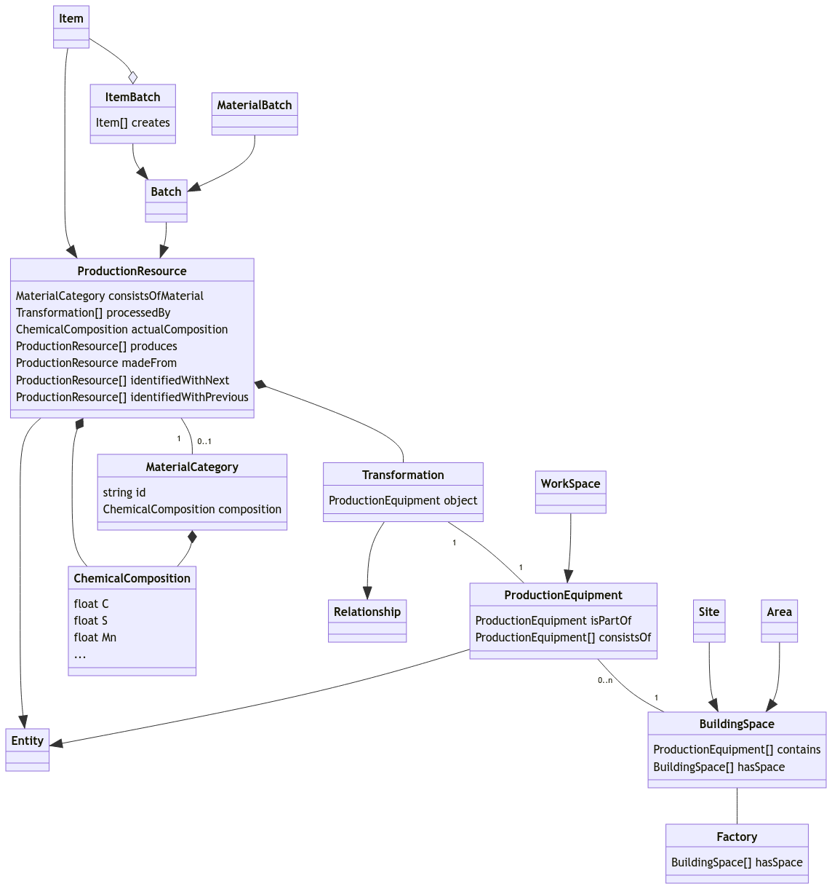

# CAPRI steel model

A data model for the steel production, loosely based on [SAREF4INMA](https://saref.etsi.org/saref4inma) and [NGSI-LD](https://www.etsi.org/deliver/etsi_gs/CIM/001_099/009/01.06.01_60/gs_CIM009v010601p.pdf).

## High-level model

The main classes are

 * **ProductionEquipment**: machines, plants
 * **ProductionResource**: products, semi-products, raw material, etc.
 
Production resources/items that have been processed by some machines carry an array of relationships *processedBy* referring to the equipment.

 
